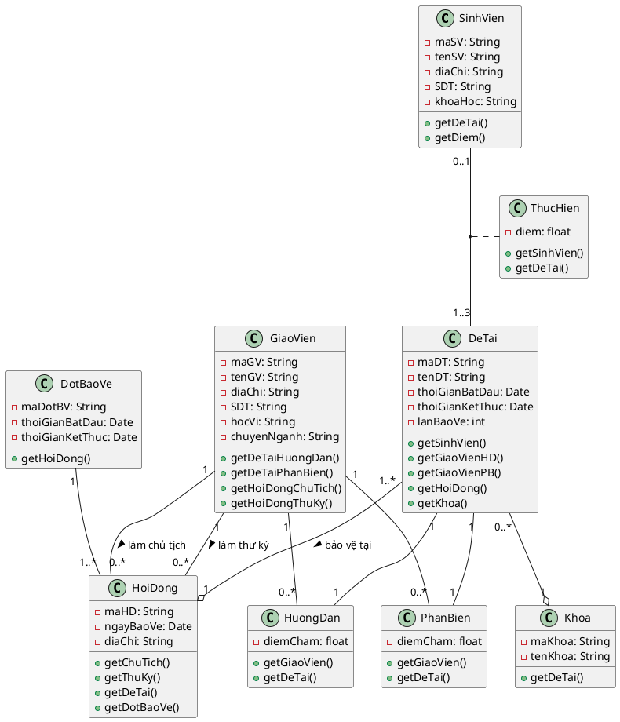
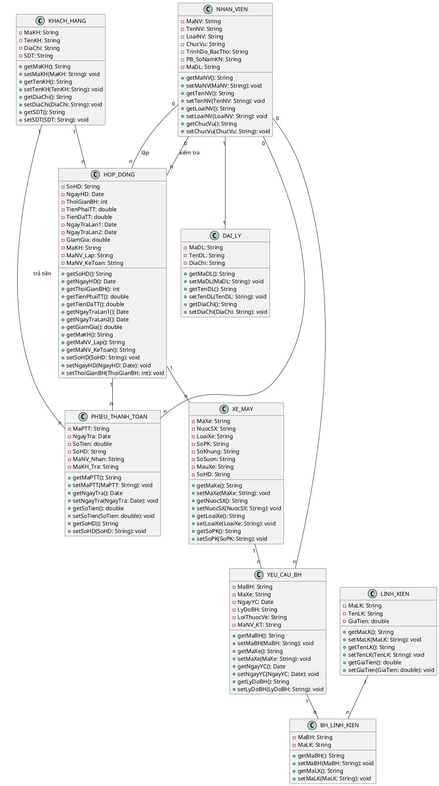

## Bài 3:

### Sơ đồ quan hệ ERD
![[Pasted image 20250315120014.png]]

#### Các mối kết hợp:

1. **TRUONGNHOM** (Là trưởng nhóm): THO (0,1) - (1,1) NHOM [Một thợ có thể là trưởng của một nhóm]
2. **THUOC**: THO (1,1) - (1,n) NHOM [Một thợ thuộc một nhóm, một nhóm có nhiều thợ]
3. **THUCHIEN**: THO (1,n) - (1,1) CONGVIEC_HOPDONG [Một thợ thực hiện nhiều công việc của hợp đồng]
4. **LIENQUAN**: CONGVIEC (1,n) - (1,1) CONGVIEC_HOPDONG [Một công việc được thực hiện trong nhiều hợp đồng]
5. **BAOTRONG**: HOPDONG (1,1) - (1,n) CONGVIEC_HOPDONG [Một hợp đồng có nhiều công việc]
6. **KY**: KHACHHANG (1,n) - (1,1) HOPDONG [Một khách hàng ký nhiều hợp đồng]
7. **SO_HUU**: KHACHHANG (1,n) - (1,1) XE [Một khách hàng sở hữu nhiều xe]
8. **LIENKET**: XE (1,n) - (1,1) HOPDONG [Một xe liên kết với nhiều hợp đồng]


### Sơ đồ lớp (Class Diagram)


```plantuml
Class Nhom {
  MANHOM: string
  TENNHOM: string
  
  Set<Tho>
  Tuple(Tho)
  
  ThemNhom()
  XoaNhom()
}

Class Tho {
  MATHO: string
  TENTHO: string
  
  Tuple(Nhom)
  Set<CongViec_HopDong>
  
  NhapTho()
  XuatTho()
}

Class CongViec {
  MACV: string
  NOIDUNGCV: string
  
  Set<CongViec_HopDong>
  
  NhapCV()
  XuatCV()
}

Class HopDong {
  MAHD: string
  NGAYKY: date
  NGAYDUKIEN: date
  NGAYGIAO: date
  TONGTRIGIA: decimal
  
  Tuple(KhachHang)
  Tuple(Xe)
  Set<CongViec_HopDong>
  
  NhapHD()
  XuatHD()
  TinhTriGia()
}

Class KhachHang {
  MAKH: string
  TENKH: string
  DIACHI: string
  SDT: string
  
  Set<HopDong>
  Set<Xe>
  
  NhapKH()
  XuatKH()
}

Class Xe {
  BIENSO: string
  NUOCSX: string
  LOAIXE: string
  SOPK: int
  SOKHUNG: string
  SOSUON: string
  MAUXE: string
  
  Tuple(KhachHang)
  Set<HopDong>
  
  NhapXe()
  XuatXe()
}

Class CongViec_HopDong {
  TRIGIACV: decimal
  
  Tuple(HopDong)
  Tuple(CongViec)
  Tuple(Tho)
  
  NhapCVHD()
  XuatCVHD()
}

```


#### Đây là mô hình lớp (Class Diagram) thể hiện rõ các lớp và mối quan hệ giữa chúng như sau:

1. **Nhom** có nhiều **Tho**, một **Tho** là trưởng của một **Nhom**
2. **Tho** thực hiện nhiều **CongViec_HopDong**
3. **CongViec** liên kết với nhiều **CongViec_HopDong**
4. **HopDong** có nhiều **CongViec_HopDong**
5. **KhachHang** có nhiều **HopDong**
6. **KhachHang** sở hữu nhiều **Xe**
7. **Xe** liên kết với nhiều **HopDong**

### Mức Logic:

- **NHOM** (MANHOM, TENNHOM, MATRUONGNHOM) - GROUP
    - MANHOM: Khóa chính
    - MATRUONGNHOM: Khóa ngoại tham chiếu đến THO
- **THO** (MATHO, TENTHO, MANHOM) - EMPLOYEE
    - MATHO: Khóa chính
    - MANHOM: Khóa ngoại tham chiếu đến NHOM
- **CONGVIEC** (MACV, NOIDUNGCV) - WORK
    - MACV: Khóa chính
- **HOPDONG** (**MAHD**, NGAYKY, NGAYDUKIEN, NGAYGIAO, TONGTRIGIA, **MAKH**, **BIENSO**) - CONTRACT
    - MAHD: Khóa chính
    - MAKH: Khóa ngoại tham chiếu đến KHACHHANG
    - BIENSO: Khóa ngoại tham chiếu đến XE
- **KHACHHANG** (MAKH, TENKH, DIACHI, SDT) - CUSTOMER
    - MAKH: Khóa chính
- **XE** (BIENSO, NUOCSX, LOAIXE, SOPK, SOKHUNG, SOSUON, MAUXE, MAKH) - CAR
    - BIENSO: Khóa chính
    - MAKH: Khóa ngoại tham chiếu đến KHACHHANG
- **CONGVIEC_HOPDONG** (MAHD, MACV, MATHO, TRIGIACV) - CONTRACT_WORK
    - (MAHD, MACV, MATHO): Khóa chính tổng hợp
    - MAHD: Khóa ngoại tham chiếu đến HOPDONG
    - MACV: Khóa ngoại tham chiếu đến CONGVIEC
    - MATHO: Khóa ngoại tham chiếu đến THO


## Bài 4
### Sơ đồ quan hệ ERD

![[Pasted image 20250313214022.png]]
Chú thích:

- **SINH_VIEN - THUC_HIEN - DE_TAI**:
    - **Bản số**: (0,1) - (1,3)
    - **Giải thích**:
        - Mỗi sinh viên thực hiện 0 hoặc 1 đề tài tốt nghiệp (có thể chưa làm)
        - Mỗi đề tài được thực hiện bởi 1 đến tối đa 3 sinh viên (theo đề bài)
    - **Thuộc tính mối quan hệ**: Diem (điểm của sinh viên cho đề tài đó)
- **GIAO_VIEN - HUONG_DAN - DE_TAI**:
    - **Bản số**: (0,n) - (1,1)
    - **Giải thích**:
        - Mỗi giáo viên có thể hướng dẫn 0 hoặc nhiều đề tài
        - Mỗi đề tài phải có đúng 1 giáo viên hướng dẫn
    - **Thuộc tính mối quan hệ**: DiemHD (điểm giáo viên hướng dẫn chấm)
- **GIAO_VIEN - PHAN_BIEN - DE_TAI**:
    - **Bản số**: (0,n) - (1,1)
    - **Giải thích**:
        - Mỗi giáo viên có thể phản biện 0 hoặc nhiều đề tài
        - Mỗi đề tài phải có đúng 1 giáo viên phản biện
    - **Thuộc tính mối quan hệ**: DiemPB (điểm giáo viên phản biện chấm)
- **DE_TAI - BAO_VE_TAI - HOI_DONG**:
    - **Bản số**: (1,1) - (1,n)
    - **Giải thích**:
        - Mỗi đề tài phải bảo vệ tại đúng 1 hội đồng
        - Mỗi hội đồng có thể chấm từ 1 đến nhiều đề tài
- **DE_TAI - THUOC - KHOA**:
    - **Bản số**: (1,1) - (0,n)
    - **Giải thích**:
        - Mỗi đề tài phải thuộc đúng 1 khoa
        - Mỗi khoa có thể có 0 hoặc nhiều đề tài
- **GIAO_VIEN - LAM_CHU_TICH - HOI_DONG**:
    - **Bản số**: (0,n) - (1,1)
    - **Giải thích**:
        - Mỗi giáo viên có thể làm chủ tịch 0 hoặc nhiều hội đồng
        - Mỗi hội đồng phải có đúng 1 giáo viên làm chủ tịch
    - **Thuộc tính mối quan hệ**: DiemCT (điểm chủ tịch chấm cho từng sinh viên)
- **GIAO_VIEN - LAM_THU_KY - HOI_DONG**:
    - **Bản số**: (0,n) - (1,1)
    - **Giải thích**:
        - Mỗi giáo viên có thể làm thư ký 0 hoặc nhiều hội đồng
        - Mỗi hội đồng phải có đúng 1 giáo viên làm thư ký
- **DOT_BAO_VE - TO_CHUC - HOI_DONG**:
    - **Bản số**: (1,n) - (1,1)
    - **Giải thích**:
        - Mỗi đợt bảo vệ tổ chức từ 1 đến nhiều hội đồng
        - Mỗi hội đồng thuộc về đúng 1 đợt bảo vệ

### Mô hình Class Diagram




### Mức Logic

- **SINH_VIEN** (**MaSV**, TenSV, DiaChi, SDT, KhoaHoc)
- **GIAO_VIEN** (**MaGV**, TenGV, DiaChi, SDT, HocVi, ChuyenNganh)
- **KHOA** (**MaKhoa**, TenKhoa)
- **DOT_BAO_VE** (**MaDotBV**, ThoiGianBatDau, ThoiGianKetThuc)
- **HOI_DONG** (**MaHD**, NgayBaoVe, DiaChi, MaChuTich, MaThuKy, MaDotBV)
    - MaChuTich → GIAO_VIEN(MaGV)
    - MaThuKy → GIAO_VIEN(MaGV)
    - MaDotBV → DOT_BAO_VE(MaDotBV)
- **DE_TAI** (**MaDT**, TenDT, ThoiGianBatDau, ThoiGianKetThuc, LanBaoVe, **MaKhoa**, **MaHD**)
    - MaKhoa → KHOA(MaKhoa)
    - MaHD → HOI_DONG(MaHD)
- **THUC_HIEN** (**MaSV**, **MaDT**, Diem)
    - MaSV → SINH_VIEN(MaSV)
    - MaDT → DE_TAI(MaDT)
- **HUONG_DAN** (MaGV, MaDT, DiemCham)
    - MaGV → GIAO_VIEN(MaGV)
    - MaDT → DE_TAI(MaDT)
- **PHAN_BIEN** (MaGV, MaDT, DiemCham)
    - MaGV → GIAO_VIEN(MaGV)
    - MaDT → DE_TAI(MaDT)


## Bài 5

### Sơ đồ ERD
![[Pasted image 20250315114925.png]]

### Mô hình Class Diagram



### Mức Logic

1. **KHACH_HANG** (MaKH, TenKH, DiaChi, SDT)
    - Khóa chính: MaKH
2. **HOP_DONG** (SoHD, NgayHD, ThoiGianBH, TienPhaiTT, TienDaTT, PhuongThucTT, NgayTraLan1, NgayTraLan2, GiamGia, MaKH, **MaNV_Lap**, **MaNV_KeToan**)
    - Khóa chính: SoHD
    - Khóa ngoại: MaKH tham chiếu KHACH_HANG(MaKH)
    - Khóa ngoại: MaNV_Lap, MaNV_KeToan tham chiếu NHAN_VIEN(MaNV)
3. **XE_MAY** (MaXe, NuocSX, LoaiXe, SoPK, SoKhung, SoSuon, MauXe, SoHD)
    - Khóa chính: MaXe
    - Khóa ngoại: SoHD tham chiếu HOP_DONG(SoHD)
4. **PHIEU_THANH_TOAN** (MaPTT, SoHD, NgayTra, SoTien, MaNV_Nhan, MaKH_Tra)
    - Khóa chính: MaPTT
    - Khóa ngoại: SoHD tham chiếu HOP_DONG(SoHD)
    - Khóa ngoại: MaNV_Nhan tham chiếu NHAN_VIEN(MaNV)
    - Khóa ngoại: MaKH_Tra tham chiếu KHACH_HANG(MaKH)
5. **NHAN_VIEN** (MaNV, TenNV, LoaiNV, ChucVu, TrinhDo_BacTho, PB_SoNamKN, MaDL)
    - Khóa chính: MaNV
    - Khóa ngoại: MaDL tham chiếu DAI_LY(MaDL)
6. **YEU_CAU_BAO_HANH** (MaBH, MaXe, NgayYC, LyDoBH, LoiThuocVe, MaNV_KT)
    - Khóa chính: MaBH
    - Khóa ngoại: MaXe tham chiếu XE_MAY(MaXe)
    - Khóa ngoại: MaNV_KT tham chiếu NHAN_VIEN(MaNV)
7. **LINH_KIEN** (MaLK, TenLK, GiaTien)
    - Khóa chính: MaLK
8. **DAI_LY** (MaDL, TenDL, DiaChi)
    - Khóa chính: MaDL
9. **BH_LINH_KIEN** (MaBH, MaLK)
    - Khóa chính: (MaBH, MaLK)
    - Khóa ngoại: MaBH tham chiếu YEU_CAU_BAO_HANH(MaBH)
    - Khóa ngoại: MaLK tham chiếu LINH_KIEN(MaLK)
